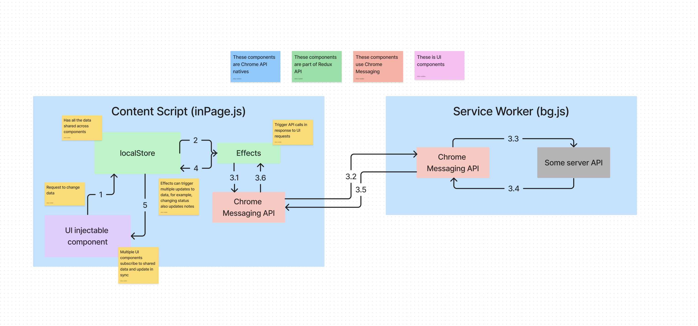

High level overview of app core

The core has the following attributes:
1. All the data shared across multiple injectable UI components is located in Redux Store, which is instantiated within the scope of current Tab 
2. Redux Actions are used to trigger changes to data in the Store
3. The Store has the Middleware configured to propagate actions to Service Workers whenever external call to API is requested
4. This propagation is implemented using Chrome Messaging API in Request/Response asynchronous fashion
5. Once response from Service Worker is received, the Middleware sends one or multiple updated to the Store affecting the shared data
6. Multiple UI components subscribed to shared state are refreshed in response to original request

Pros and Cons

Pros:
1. Traditional architecture with usage of a familiar and mature API
2. No duplication of server requests in cases, when same data is used in multiple UI components
3. Immediate update to UI if data manipulations can take place locally

Cons:
1. Quite sophisticated design and architecture with some room for future optimization
2. High entry barrier inexperienced developers